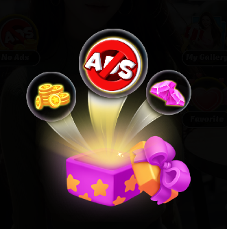

# UPack-Spine-Adapter

error: This mesh uses multiple atlas pages or blend modes. You need to enable "Multiple Canvas Renderers" for correct rendering. Consider packing attachments to a single atlas page if possible

This error specifically happens when you are using Spine in the UI (using the SkeletonGraphic component) instead of in the game world.

Unity's UI system is very strict: One UI object = One Material.
However, your Spine character needs two (or more) materials to render correctly. This happens for one of two reasons:
Blend Modes: You have "Additive" slots (like the glow you asked about). The main body needs a "Normal" material, and the glow needs an "Additive" material. That is 2 materials.
Atlas Pages: Your character is huge, so its texture didn't fit on one image. Spine split it into Texture_A.png and Texture_B.png. That requires 2 materials.
Since a standard UI object cannot handle 2 materials at once, it breaks.

Here is how to fix it:
Solution 1: The "Checkbox" Fix (Recommended)
You need to tell the SkeletonGraphic component that it is allowed to spawn extra "child" objects to handle the extra materials.
Select your GameObject with the SkeletonGraphic component.
Look in the Inspector for the Advanced section (sometimes it's just at the bottom).
Check the box "Multiple Canvas Renderers".
Result: Unity will automatically create hidden child GameObjects to render the Additive parts or the second texture page.

Solution 2: The "Optimization" Fix (For Atlas Issues)
If the error was caused by Multiple Atlas Pages (not blend modes), checking the box works, but it is slightly slower performance-wise.
Better Fix: Go back to Spine -> Texture Packer Settings.
Action: Increase the Max Width/Height (e.g., from 1024 to 2048) so the whole character fits on a single page.
Note: If the error is caused by Blend Modes (Additive), you cannot optimize it away. You must use Solution 1 because Additive and Normal rendering physically require different math (different materials).

